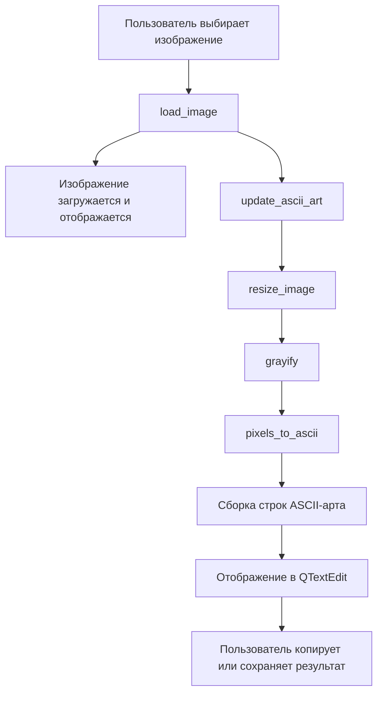

 # ASCII Art Converter

Приложение для преобразования изображений в ASCII-арт с использованием PyQt6 и Pillow.

## 1. Структура проекта

```
.
└── ascii_art.py (13KB, 303 строки)
```

## 2. Описание файлов

### ascii_art.py

#### Назначение
Основной файл приложения, содержащий весь исходный код. Реализует графический интерфейс и логику преобразования изображений в ASCII-арт.

#### Ключевые функции/классы

- **Вспомогательные функции**:
  - `resize_image()` - изменяет размер изображения с сохранением пропорций
  - `grayify()` - преобразует изображение в оттенки серого
  - `pixels_to_ascii()` - преобразует пиксели в символы ASCII
  - `image_to_ascii()` - объединяет функции для получения ASCII-арта
  - `pil2pixmap()` - конвертирует PIL Image в QPixmap для отображения

- **Пользовательские классы UI**:
  - `StyledButton` - кнопка с улучшенным стилем для темной темы
  - `ImageLabel` - расширенный QLabel для отображения изображений

- **Основной класс приложения**:
  - `AsciiArtApp` - главное окно приложения с методами:
    - `setup_ui()` - создание интерфейса
    - `load_image()` - загрузка изображения
    - `update_ascii_art()` - обновление ASCII-арта
    - `get_current_charset()` - получение выбранного набора символов
    - `copy_to_clipboard()` - копирование в буфер обмена
    - `save_to_file()` - сохранение в файл

#### Связи с другими файлами
Автономный файл без внешних зависимостей в проекте.

#### Краткое объяснение логики
1. При запуске создается интерфейс с разделенными областями для оригинального изображения и ASCII-арта
2. Пользователь выбирает изображение через диалог открытия файла
3. Изображение преобразуется в оттенки серого, масштабируется
4. Каждый пиксель заменяется символом из выбранного набора в зависимости от яркости
5. Результат отображается в текстовом поле
6. Пользователь может скопировать результат или сохранить его в файл

## 3. Архитектура проекта

### Общая структура

Приложение построено по принципу Model-View-Controller, где:
- **Model**: Функции преобразования изображения (`resize_image`, `grayify`, `pixels_to_ascii`)
- **View**: Элементы интерфейса (`QTextEdit`, `ImageLabel`, кнопки)
- **Controller**: Методы класса `AsciiArtApp`, обрабатывающие действия пользователя

### Потоки данных



## 4. Библиотеки/фреймворки

### PyQt6
**Назначение**: Создание графического интерфейса пользователя
**Где используется**: Во всем приложении для создания окон, кнопок, текстовых полей и обработки событий

Основные используемые модули:
- `PyQt6.QtWidgets` - для элементов интерфейса (QMainWindow, QTextEdit, QPushButton и др.)
- `PyQt6.QtCore` - для базовых классов (Qt, QSize)
- `PyQt6.QtGui` - для работы с изображениями и шрифтами (QFont, QPixmap, QImage)

### Pillow (PIL)
**Назначение**: Обработка изображений
**Где используется**: Для манипуляций с изображениями:
- Загрузка изображений
- Преобразование в оттенки серого
- Изменение размера
- Извлечение данных пикселей

### Встроенные библиотеки
- `sys` - для выхода из приложения
- `io` - для преобразования изображений в байтовый поток

## 5. Точка входа и запуск

### Что выполняется первым
1. Создаётся экземпляр QApplication
2. Создаётся главное окно (AsciiArtApp)
3. Вызывается метод show() для отображения окна
4. Запускается цикл обработки событий (app.exec())

## 6. Архитектурные особенности

### Нестандартные решения

1. **Адаптивное масштабирование изображений**:
   - Использование `QSizePolicy` и переопределение `resizeEvent` для корректного отображения изображений при изменении размера окна

2. **Улучшенная конвертация изображений**:
   - Алгоритм выбора символов с учетом полного диапазона яркости (0-255)
   - Расчет шага для соответствия числу символов в наборе

3. **Кастомные UI-компоненты**:
   - Класс `StyledButton` для стилизованных кнопок
   - Класс `ImageLabel` с поддержкой масштабирования

4. **Тёмная тема оформления**:
   - Реализация через QSS (Qt Style Sheets)
   - Детализированные стили для всех компонентов

### Причины выбора архитектуры

1. **Монолитный дизайн**:
   - Ввиду небольшого размера приложения, весь код помещен в один файл
   - Упрощает распространение и запуск

2. **Функциональное разделение кода**:
   - Логика преобразования изображений вынесена в отдельные функции
   - UI-компоненты инкапсулированы в классы

3. **Использование встроенных возможностей PyQt6**:
   - QSplitter для разделения областей отображения
   - QMessageBox для уведомлений
   - Стили QSS для оформления

## 7. Инструкция по использованию

1. **Запуск приложения**:
   - Установите зависимости: `pip install PyQt6 Pillow`
   - Запустите: `python ascii_art.py`

2. **Работа с приложением**:
   - Нажмите "Загрузить изображение" и выберите файл
   - Настройте ширину ASCII-арта с помощью ползунка
   - Выберите набор символов из выпадающего списка
   - Просмотрите результат в правой панели
   - При необходимости скопируйте результат в буфер обмена или сохраните в файл

3. **Доступные наборы символов**:
   - Полный набор (70 символов) - максимальная детализация
   - Стандартный (@%#*+=-:. ) - классический набор
   - Простой (▓▒░ ) - минималистичный вариант 
